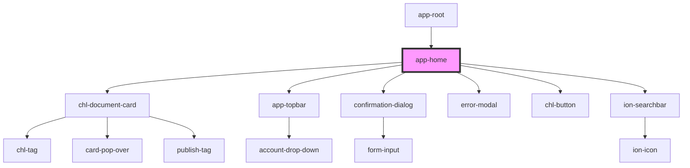

# app-home

<!-- Auto Generated Below -->

## Properties

| Property         | Attribute | Description | Type              | Default     |
| ---------------- | --------- | ----------- | ----------------- | ----------- |
| `contents`       | --        |             | `Content[]`       | `undefined` |
| `featuredImages` | --        |             | `FeaturedImage[]` | `undefined` |
| `organisation`   | --        |             | `Organisation`    | `undefined` |
| `spaces`         | --        |             | `Space[]`         | `undefined` |
| `user`           | --        |             | `User`            | `undefined` |

## Dependencies

### Used by

 - [app-root](../app-root)

### Depends on

- chl-document-card
- [app-topbar](../app-topbar)
- confirmation-dialog
- [error-modal](../../molecules/error-modal)
- [chl-button](../../atoms/button)
- ion-searchbar

### Graph

----------------------------------------------

*Made with 💛💙💜 and 😢*
